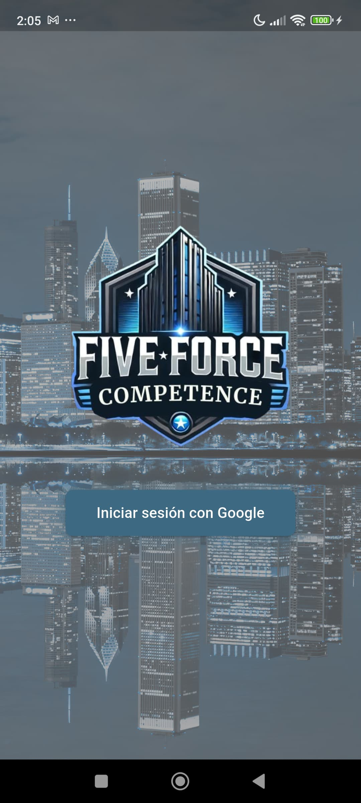
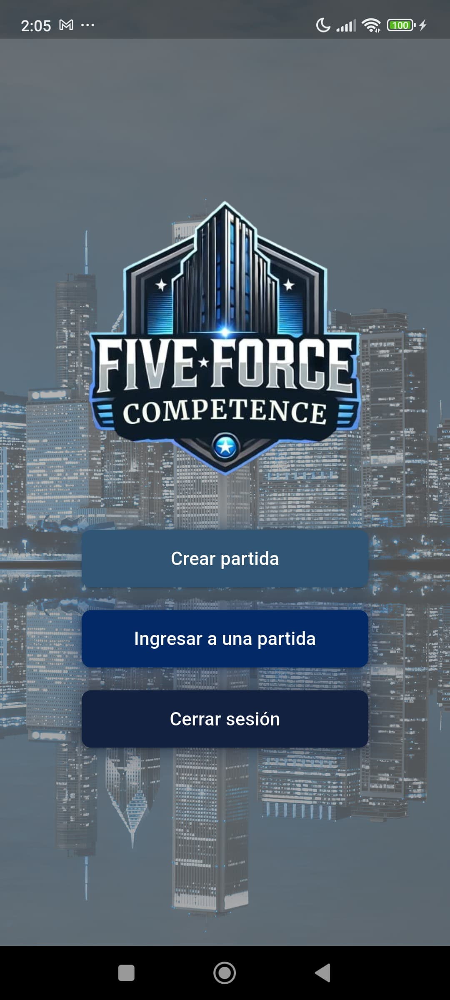
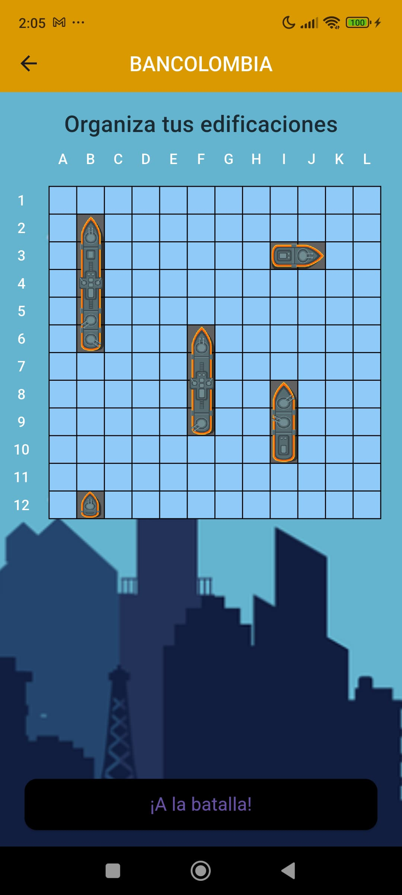

# :ship: Five Force ([Flutter Flame 🔥](https://pub.dev/packages/flame))

**Five Force** es un juego estratégico multijugador desarrollado en **Flutter**, con el motor de juegos **Flame** y usando **Firebase** como backend.

Este juego combina la emoción de un clásico como *Batalla Naval* con un enfoque empresarial innovador basado en las **Cinco Fuerzas Competitivas de Porter**.

## 🎮 ¿De qué trata?

De 2 a 4 jugadores compiten como empresas dentro de un mismo sector económico. Cada jugador debe posicionar estratégicamente cinco edificaciones que representan una de las cinco fuerzas competitivas:

- **Amenaza de nuevos competidores**
- **Poder de negociación de los proveedores**
- **Poder de negociación de los clientes**
- **Amenaza de productos sustitutos**
- **Rivalidad entre competidores existentes**

El objetivo es dominar el sector descubriendo y eliminando las edificaciones de las demás empresas, utilizando estrategia y conocimiento del entorno competitivo.

## 🛠️ Tecnologías utilizadas

- **Flutter**
- **Flame Engine**
- **Firebase** (autenticación, almacenamiento en la nube y sincronización en tiempo real)
- **Dart**

## 🚧 Estado del proyecto

Proyecto actualmente en desarrollo.  
Se están implementando las mecánicas por turnos, lógica multijugador y sincronización de partidas en tiempo real.

## ▶️ Example

  
  
  

